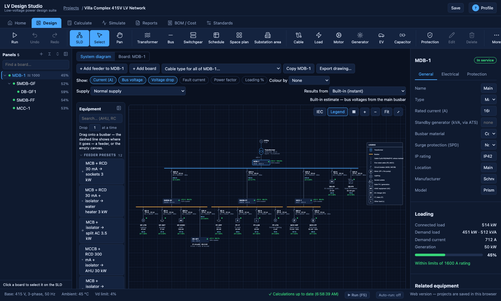
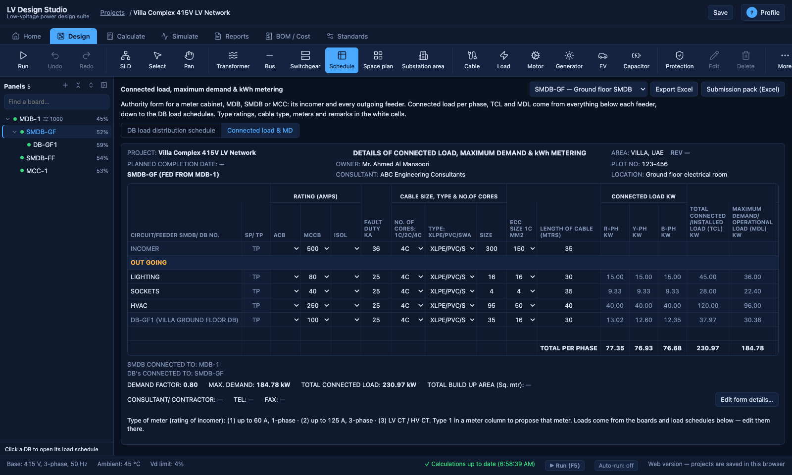
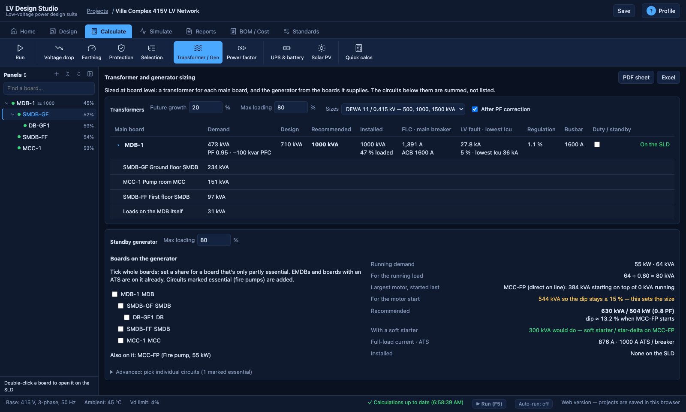
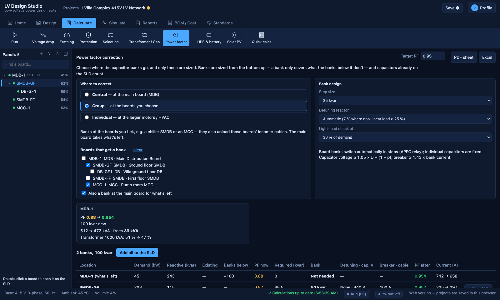
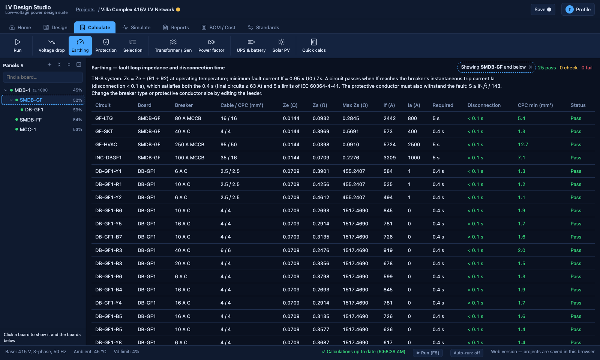
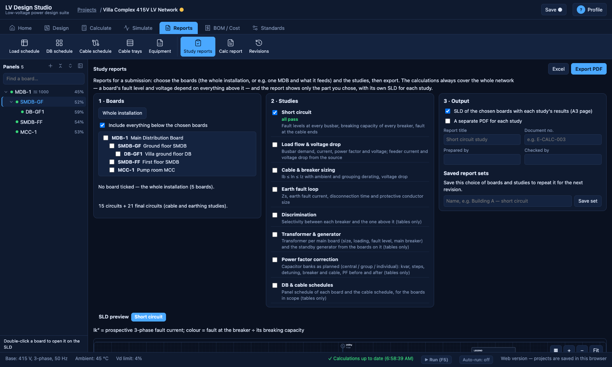
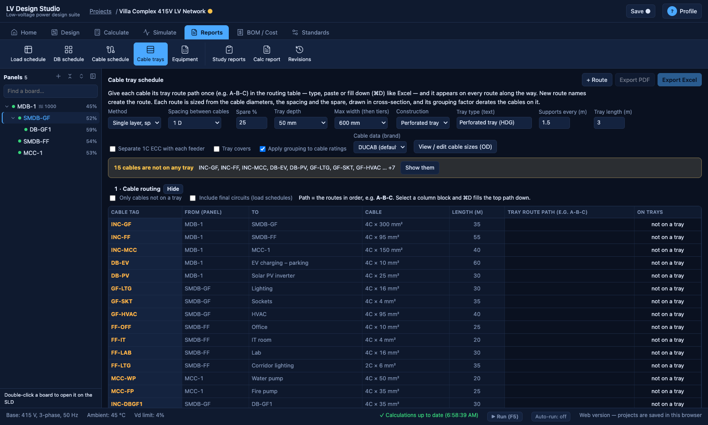
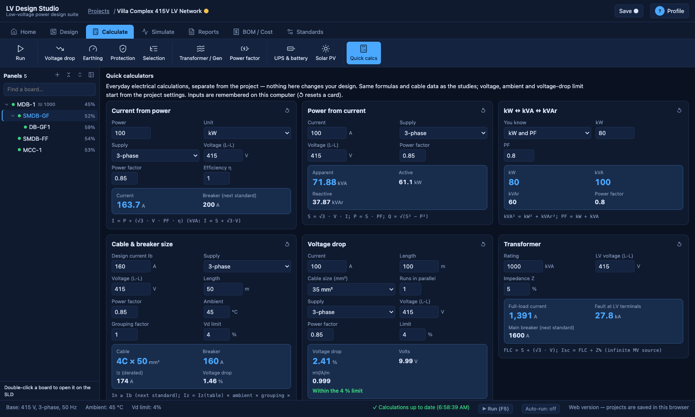
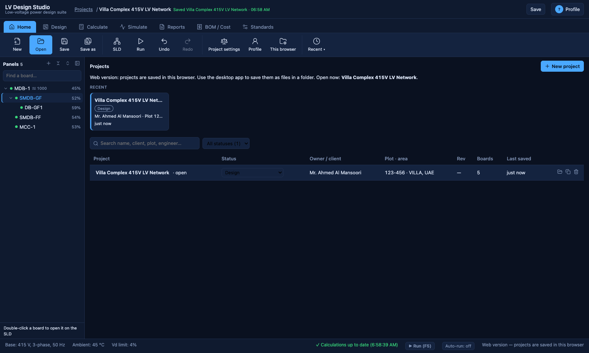

# LV Design Studio (v0.1 — working scaffold)

An offline desktop app for LV electrical design: single-line diagram, voltage
drop, cable sizing, short-circuit and discrimination checks, and project
files saved as plain JSON so they sync cleanly through a Google Drive /
OneDrive / Dropbox desktop folder.

This is a real, running scaffold — not a mockup. The calculations in
`src/calc/` are genuine formulas (IEC 60228 cable resistance data, IEC
60364-5-52 ambient derating, standard voltage-drop and fault-current
equations), not fake numbers. Treat the reference cable/ampacity table as a
starting point to replace with your manufacturer's datasheets or exact
DEWA/IEC tables before relying on it for real projects.

## Screenshots

The built-in demo project (a 415 V villa complex).

**Single line diagram**: IEC symbols and a legend, the panel tree on the left, the equipment palette, and properties on the right.


**Load schedule**: the DEWA connected load / maximum demand form for the board picked in the panel tree.


**Transformer & generator sizing**: a transformer per MDB (fault level, main breaker, regulation, Apply to SLD), and the generator chosen by board, with the largest motor starting last.


**Power factor correction**: central, group or individual correction. Banks are sized from the bottom up (nothing is corrected twice), with steps and detuning. Add them to the SLD.


**Earthing, filtered from the panel tree**: click SMDB-GF to see only that board and the boards below it.


**Study reports**: choose boards and studies (short circuit, load flow, PFC…) and export a submission PDF or Excel file, with an SLD for each study.


**Cable tray schedule**: route paths (A-B-C), tray sizing with DUCAB cable data, grouping derating, cross-sections and BOQ.


**Quick calculators**: amps, kW/kVA, cable & breaker, voltage drop, transformer and more.


**Projects dashboard**: recent projects, status (Design → Submitted → Approved), search, duplicate.


## Setup

Requires [Node.js](https://nodejs.org) 18 or later.

```bash
cd lv-design-studio
npm install
npm run dev
```

This opens the app in an Electron window with a sample project loaded
(the same villa-complex scenario from the earlier mockup, now computed for
real). Click any feeder in the diagram or table to see its properties.

## Saving projects to Google Drive

On first run the app creates `~/LV Design Studio Projects`. Click the
**projects folder** button on the ribbon's **Home** tab and point it at a folder
inside your Google Drive desktop-sync folder (e.g.
`~/Google Drive/My Drive/LV Projects`). Every "Save" writes a plain `.json`
file there, which Drive then syncs automatically — no login or API needed
inside the app itself.

## Building an installer

```bash
npm run dist
```

Produces a `.dmg` (mac), `.exe` installer (Windows), or `.AppImage` (Linux)
in `release/`, depending on the platform you build on.

## Tests

```bash
npm test
```

Unit tests (Vitest) in `src/**/*.test.ts` check the calculation engine
against hand-worked values and cover the OpenDSS exporter.

## Database (Excel, synced by Google Drive)

Reusable data lives in Excel workbooks in the `LV Database` folder inside
your projects folder, so Google Drive syncs it across PCs and to anyone
sharing the folder:

| Workbook | Contents | Starts with |
|---|---|---|
| `Loads.xlsx` | Your equipment: name, category, schedule column, power (W), PF, phases, demand factor, starting, manufacturer/model | Empty — user input only |
| `Cables.xlsx` | Size, R at 20 °C, X, current rating, rate per m — used by every calculation | The app's reference values, to replace with manufacturer data |
| `Breakers.xlsx` | Ratings the sizing may choose, Icu, price | Standard ratings |
| `Parameters.xlsx` | Design defaults for new projects (VD limit, ambient, min wires, ELCB mA, ...) | Parameter names, blank values |

The app creates any missing workbook (never overwrites one) and watches the
folder: save a workbook in Excel and the app updates within a second or two.
Library items can be picked for a load schedule's WATT/UNIT column or in the
feeder form; columns linked to a library item follow it when it changes.
Problems (bad rows, missing columns) are listed on the Database screen.

## Calculation engines

The built-in TypeScript engine (`src/calc/`) drives the live UI. Two external
engines can be run on demand from **Reports → Engine comparison**, which
shows their results next to the built-in engine's for every feeder:

| Engine | What it adds |
|---|---|
| **OpenDSS** (via OpenDSSDirect.py) | Full load flow, including unbalance from single-phase loads; fault study |
| **pandapower** | Newton-Raphson load flow; IEC 60909 maximum short circuit (cmax = 1.10, transformer KT correction) |

Both run in a small Python helper (`engines/python/lvds_engine.py`) that the
Electron main process starts on demand. Setup:

```bash
pip install opendssdirect.py pandapower
```

The app uses `python` on Windows and `python3` elsewhere; pick a different
interpreter with **Choose Python…** on the comparison screen.

**OpenDSS script export:** *Reports → Export OpenDSS (.dss)* writes the
network as a self-contained OpenDSS script (load flow + fault study) that
you can open in OpenDSS itself. The modelling assumptions are listed in the
header of the exported file.

## What's real vs. what's next

**Working now:**
- Data model (`src/types.ts`) — boards, feeders, cable, breaker fields
- Calculation engine (`src/calc/electrical.ts`, `cableTable.ts`):
  - design current and ambient-derated ampacity
  - voltage drop per feeder **and cumulative from the source**, which is the
    value checked against the limit
  - overload protection check Ib ≤ In ≤ Iz (IEC 60364-4-43)
  - fault levels from R+jX impedance: at the breaker's busbar (checked
    against Icu) and at the cable end
- Whole-system single line diagram (utility → transformer → boards → loads)
  with zoom/pan, load-type icons, and click-to-select boards and feeders
- System summary (connected/demand load, kVA, power factor, transformer
  loading) and a bus voltage / board loading table
- Board properties panel (General / Electrical / Protection) with editable
  equipment data and board loading against its rating
- Studies: earthing (Zs, disconnection time, CPC adiabatic check), breaker
  and cable selection (fix-only or optimise, apply per row or all),
  protection coordination (time-current curves, current-based selectivity),
  transformer and generator sizing, power factor correction
- Documents: DB schedule, cable schedule, equipment schedule (CSV for
  Excel), and a PDF calculation report
- Editing feeders and boards from the UI, multi-level board hierarchy,
  cable-size suggestion that respects the breaker rating and the voltage-drop
  budget left after upstream drops
- BOQ CSV export, OpenDSS script export, and side-by-side comparison with
  OpenDSS and pandapower
- Project save/load as JSON, Drive-sync friendly

**Not built yet — natural next steps:**
- Grouping/installation-method correction factors for cable sizing
  (only ambient temperature is modelled right now)
- Manufacturer breaker curves / selectivity tables (curves are generic now)
- Exact DEWA panel-schedule template (current DB schedule is a generic layout)
