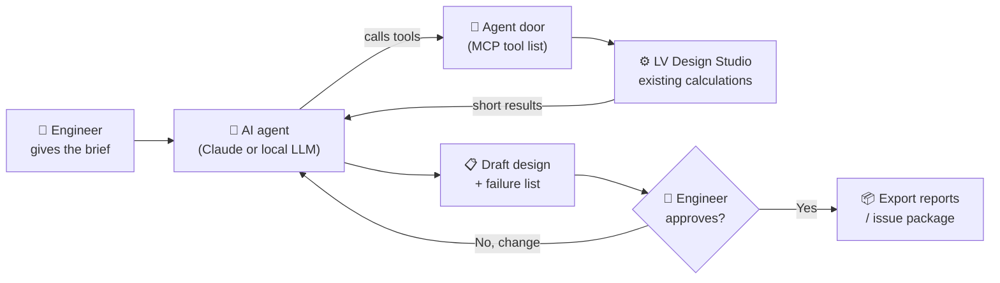
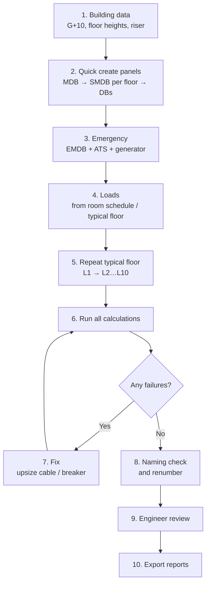
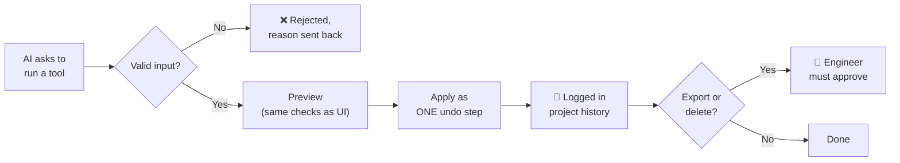
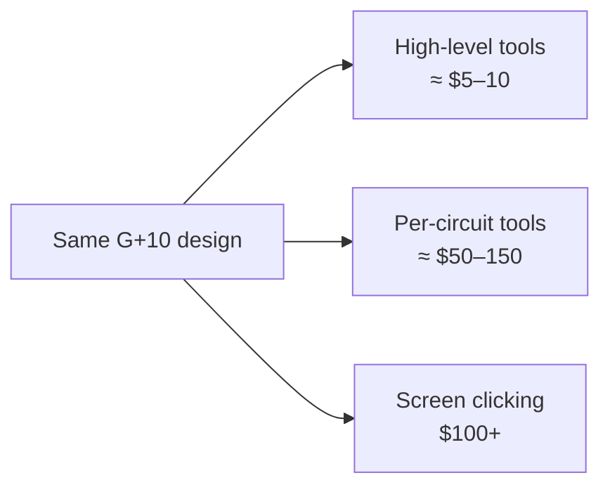
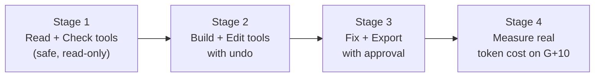

# Proposal: AI Agent for LV Design Studio

**Goal:** let an AI assistant (Claude, or a free local model on the Mac) build and check a full building electrical design *inside* LV Design Studio, with the engineer approving the result.

---

## 1. The big picture

- The **app already has the engineering** (sizing, voltage drop, fault level, reports).
- What we add is the **agent door**: a short list of safe tools the AI is allowed to use.
- **The engineer always has the final say** — nothing is exported without approval.

---

## 2. How the agent builds a G+10 building

Each box is **one or a few tool calls**, not thousands of clicks. That is what keeps it fast and cheap.

---

## 3. The tool list (about 15–20 tools)

| Group | Tools | Uses what already exists |
|---|---|---|
| Read | `get_project_summary`, `list_panels`, `get_panel` | Project JSON |
| Build | `set_building`, `quick_create_panels`, `add_emergency`, `repeat_branch` | Quick create, emergency plan, branch copy |
| Loads | `import_load_schedule`, `generate_dbs_from_rooms`, `set_loads` | Schedule import, room DB generator |
| Edit | `set_level`, `set_fed_from`, `rename_panels` | Panel list, Naming tab |
| Check | `run_calculations`, `list_failures` | Calc engine (returns *short* summary) |
| Fix | `size_feeder`, `fix_failing_circuits` | Auto-sizing |
| Finish | `size_enclosures`, `export_reports` *(needs approval)* | Enclosure sizing, report export |

---

## 4. Safety rules

1. Every change goes through the **same checks** the screens use.
2. Every change is **one undo step** — the engineer can roll back anything.
3. **No export, delete or overwrite** without engineer approval.
4. Agent actions are **logged** so the engineer can see what it did.

---

## 5. Approximate cost — complete G+10 design

Assumed: ~200 panels, ~2,000 circuits, prompt caching on.

| How the agent works | Tool calls | Claude Opus 5.5 | Claude Sonnet 5.5 | Local LLM |
|---|---|---|---|---|
| **A. High-level tools (this proposal)** | ~150 | **≈ $8–10** | **≈ $4–5** | $0 (slower, less reliable) |
| B. One circuit at a time | ~3,000 | ≈ $100–150 | ≈ $50–75 | not practical |
| C. Clicking the screen | thousands | $200+ | $100+ | not practical |

These are planning estimates. The real figure will be **measured** on a test project once the tools exist.

---

## 6. Build stages

| Stage | Result for the engineer |
|---|---|
| 1 | Ask the AI: *"What's failing on L3?"* — it reads, never changes. |
| 2 | *"Create G+10 with one SMDB per floor and 4 DBs each."* |
| 3 | *"Fix all voltage-drop failures and prepare reports."* — waits for your OK. |
| 4 | A real cost figure (tokens + $) for a G+10 test project. |

**No paid services needed in the app itself** — the user brings their own Claude key, or runs a free local model.
